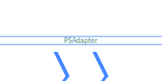

 
<a href='https://github.com/sponsors/StartAutomating'>❤️</a>
<a href='https://github.com/StartAutomating/PSAdapter/stargazers'>⭐</a>

# PSAdapter

Adapt anything into PowerShell Commands.

PSAdapter is a module that helps you build and manage PowerShell Command Adapters.

## A bit of background

PowerShell is full of amazing capabilities that are underknown and underused.

This modules is here to help demonstrate one of these areas:  [CmdletAdapters](https://learn.microsoft.com/en-us/dotnet/api/microsoft.powershell.cmdletization.cmdletadapter-1?view=powershellsdk-7.4.0&wt.mc_id=MVP_321542).

CmdletAdapters have existed since PowerShell Version 3, and are the part of PowerShell
that makes `.cdxml` files work.

Many people do not realize that CmdletAdapters are extensible, and thus, an adapter could be made for almost anything.

This module exists to help make CmdletAdapters, and provides some example .cdxml files that use these adapters.

## Using PSAdapter

### Installing

You can install PSAdapter from the PowerShell gallery:

~~~PowerShell
Install-Module -Name PSAdapter -Scope CurrentUser
~~~

## Adapter Types Included

PSAdapter ships several implementations of adapters:

* PSDotNetAdapter adapts any .NET class into Cmdlets
* PSEventAdapter creates Cmdlets that broadcast events
* PSMarkupAdapter creates Cmdlets that make markup

